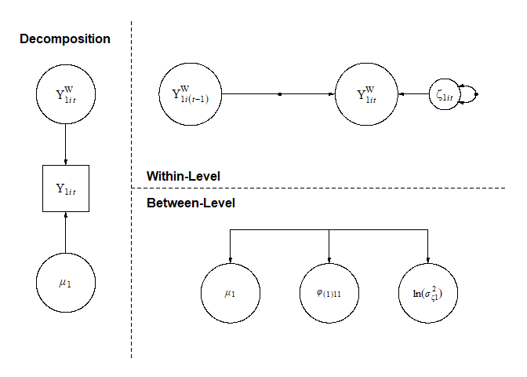
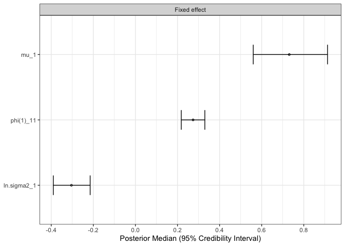

<!-- README.md is generated from README.Rmd. Please edit that file -->

# mlts

<!-- badges: start -->

[](https://cranlogs.r-pkg.org/badges/mlts)

<!-- badges: end -->

## Overview

The `mlts` package allows fitting multilevel manifest or latent time
series models and dynamic structural equation models (DSEM), as
described in Asparouhov et al. (2018). It relies on
[Stan](https://mc-stan.org) (Stan Development Team, 2023b) and the
`rstan` package (Stan Development Team, 2023a) for Bayesian inference.
The package is designed for researchers working with intensive
longitudinal data, e.g., data from ambulatory assessment studies or
experience sampling methods. Models allow for missing data, unequal
numbers of observations across units, unequally spaced observations, and
approximation of continuous time processes. Parameters can be subjected
to restrictions (i.e., fixations or equality constraints) and latent
variables can be incorporated using a measurement model. For the models
hypothesized by the user, a LaTex formula and path models can be
inspected, and model parameters can be plotted.

## Installation

The most recent `mlts` release can be installed from CRAN via

``` r
install.packages("mlts")
```

To install the development version from [GitHub](https://github.com/),
you need to install the `rstan`-package first and configure your R
installation to be able to compile C++ code. You can find instructions
for both steps on the [RStan
GitHub](https://github.com/stan-dev/rstan/wiki/RStan-Getting-Started).
Afterwards, you can install the development version of `mlts` with

``` r
# install.packages("devtools")
devtools::install_github("munchfab/mlts")
```

## A Simple Example

``` r
# load package
library(mlts)
```

One of the simplest models we can fit with `mlts` is a multilevel first
order autoregressive model with only one observed variable. We start by
specifying the model with `mlts_model()`. The argument `q` controls the
number of time-series constructs. For this simple model, the following
call is sufficient:

``` r
# build a simple autoregressive model
ar1_model <- mlts_model(q = 1)
```

We can check the parameters present in the model by just calling the
object:

``` r
ar1_model
#>                              Model   Level             Type
#> mu_1                    Structural  Within     Fixed effect
#> phi(1)_11               Structural  Within     Fixed effect
#> ln.sigma2_1             Structural  Within     Fixed effect
#> sigma_mu_1              Structural Between Random effect SD
#> sigma_phi(1)_11         Structural Between Random effect SD
#> sigma_ln.sigma2_1       Structural Between Random effect SD
#> r_mu_1.phi(1)_11        Structural Between   RE correlation
#> r_mu_1.ln.sigma2_1      Structural Between   RE correlation
#> r_phi(1)_11.ln.sigma2_1 Structural Between   RE correlation
#>                                           Param             Param_Label
#> mu_1                                       mu_1                   Trait
#> phi(1)_11                             phi(1)_11                 Dynamic
#> ln.sigma2_1                         ln.sigma2_1 Log Innovation Variance
#> sigma_mu_1                           sigma_mu_1                   Trait
#> sigma_phi(1)_11                 sigma_phi(1)_11                 Dynamic
#> sigma_ln.sigma2_1             sigma_ln.sigma2_1 Log Innovation Variance
#> r_mu_1.phi(1)_11               r_mu_1.phi(1)_11                  RE Cor
#> r_mu_1.ln.sigma2_1           r_mu_1.ln.sigma2_1                  RE Cor
#> r_phi(1)_11.ln.sigma2_1 r_phi(1)_11.ln.sigma2_1                  RE Cor
#>                         isRandom prior_type prior_location prior_scale
#> mu_1                           1     normal              0        10.0
#> phi(1)_11                      1     normal              0         2.0
#> ln.sigma2_1                    1     normal              0        10.0
#> sigma_mu_1                     0     cauchy              0         2.5
#> sigma_phi(1)_11                0     cauchy              0         2.5
#> sigma_ln.sigma2_1              0     cauchy              0         2.5
#> r_mu_1.phi(1)_11               0        LKJ              1          NA
#> r_mu_1.ln.sigma2_1             0        LKJ              1          NA
#> r_phi(1)_11.ln.sigma2_1        0        LKJ              1          NA
```

When `mlts_model()` sets up this model, all model parameters are free
(i.e., not constrained) by default. On the within level, there are three
fixed effects: the grand mean (`mu_1`) of the outcome, the
autoregressive effect (`phi(1)_11`), and the natural log of the
innovation variance (`ln.sigma2_1`). The `(1)` in brackets for the
autoregressive effect parameter indicates a lag of first order, and the
`_11` subscript denotes that the first construct is as well predicted by
the first construct. Note that for the innovation variance, the natural
log is used to prevent the variance from dropping below zero. For each
of these effects, random effects are also estimated on the between
level, which are drawn from a multivariate normal distribution with zero
mean. Standard deviations of random effects are indicated with a
`sigma_` prefix, and random effect correlations are indicated with an
`r_` prefix.

A TeX formula for the above model can be obtained by calling the
`mlts_model_formula()` function on the model object. By default, the
function produces an RMarkdown file and renders it to a pdf file using
`knitr`. However, the TeX file can also be kept by calling
`keep_tex = TRUE` within the function call.

``` r
mlts_model_formula(ar1_model)
```

<center>

Decomposition.
</center>

$$
\begin{gathered} \begin{bmatrix}
y_{1, it} \\
\end{bmatrix} = \begin{bmatrix}
\mu_{1,i} \\
\end{bmatrix}
+
\begin{bmatrix}
y_{1, it}^w \\
\end{bmatrix} \end{gathered}
$$

<center>

Within-level model.
</center>

$$
\begin{gathered} \begin{bmatrix}
y_{1, it}^w \\
\end{bmatrix} = \begin{bmatrix} \phi_{(1)11,i} \\ \end{bmatrix} \begin{bmatrix} y_{1,i(t - 1)}^w \\ \end{bmatrix} +  \begin{bmatrix} \zeta_{1, it} \\ \end{bmatrix} ,\\ 
\text{with}~\zeta_{1,it} \sim \mathit{N}(0, \sigma^2_{\zeta_{1},i})  \end{gathered}
$$

<center>

Between-level model.
</center>

$$
\begin{gathered} \begin{bmatrix} \mu_{1,i}\\
\phi_{(1)11,i}\\
\ln(\sigma^2_{\zeta_{1},i})\\ \end{bmatrix} = \begin{bmatrix} \gamma_{0,\mu_{1}}\\
\gamma_{0,\phi_{(1)11}}\\
\gamma_{0,\ln(\sigma^2_{\zeta_{1}})}\\ \end{bmatrix} +
  \begin{bmatrix} \upsilon_{\mu_{1},i}\\
\upsilon_{\phi_{(1)11},i}\\
\upsilon_{\ln(\sigma^2_{\zeta_{1}}),i}\\ \end{bmatrix} ,\\ 
\text{with}~
  \upsilon_{i} \sim \mathit{MVN}(\mathbf{0}, \mathbf{\Omega})  \end{gathered}
$$

Furthermore, a path model can also be produced with the function
`mlts_paths()` with many options for adjustment.



To fit the above model, we pass it together with the data set to
`mlts_fit()`. The data set for this example is an artificial data set
simulated from an autoregressive model:

``` r
head(ar1_data)
#>   ID time    Y1
#> 1  1    1  1.16
#> 2  1    2 -0.29
#> 3  1    3  0.40
#> 4  1    4 -0.18
#> 5  1    5 -0.66
#> 6  1    6  0.42
```

We need to specify the variable in `data` that contains the time-series
process in the `ts` argument and the variable that contains the unit
identifier in the `id` argument. With the argument `tinterval`, the time
interval for approximation of a continuous time process can be specified
Asparouhov et al. (2018). We don’t specify it here, but see the Vignette
*Approximation of a Continuous Time Model* for more details.

``` r
ar1_fit <- mlts_fit(
  model = ar1_model,
  data = ar1_data,
  id = "ID",
  ts = "Y1",
  iter = 4000
)
```

The model `summary()` shows general information about the model and
data:

``` r
summary(ar1_fit, digits = 2)
#> Time series variables as indicated by parameter subscripts: 
#>    1 --> Y1
#> Data: 2500 observations in 50 IDs
#> Model convergence criteria: 
#>   Maximum Potential Scale Reduction Factor (PSR; Rhat): 1.005 (should be < 1.01)
#>   Minimum Bulk ESS: 574 (should be > 200, 100 per chain) 
#>   Minimum Tail ESS: 864 (should be > 200, 100 per chain) 
#>   Number of divergent transitions: 0 (should be 0) 
#> 
#> Posterior Summary Statistics
#> Fixed Effects:
#>               Mean   SD  2.5% 97.5% Rhat Bulk_ESS Tail_ESS
#>         mu_1  0.73 0.09  0.56  0.91    1     4267     3055
#>    phi(1)_11  0.27 0.03  0.22  0.33    1     2081     2724
#>  ln.sigma2_1 -0.30 0.04 -0.39 -0.22    1     2445     2648
#> 
#> Random Effects SDs:
#>                    Mean   SD 2.5% 97.5% Rhat Bulk_ESS Tail_ESS
#>         sigma_mu_1 0.60 0.07 0.48  0.75 1.00     3793     2800
#>    sigma_phi(1)_11 0.13 0.03 0.07  0.20 1.01      709      910
#>  sigma_ln.sigma2_1 0.23 0.04 0.15  0.32 1.00      934     1705
#> 
#> Random Effects Correlations:
#>                        Mean   SD  2.5% 97.5% Rhat Bulk_ESS Tail_ESS
#>         mu_1.phi(1)_11 0.01 0.20 -0.39  0.41    1     2094     2947
#>       mu_1.ln.sigma2_1 0.22 0.18 -0.16  0.55    1     2401     2345
#>  phi(1)_11.ln.sigma2_1 0.12 0.26 -0.41  0.61    1      821     1899
#> 
#> Samples were drawn using NUTS on Mon Dec  8 09:33:20 2025.
#> For each parameter, Bulk_ESS and Tail_ESS are measures of effective
#> sample size, and Rhat is the potential scale reduction factor
#> on split chains (at convergence, Rhat = 1).
```

The line
`Time series variables as indicated by parameter subscripts: 1 --> Y1`
shows that model parameters indexed by a `_1` refer to the variable `Y1`
in the data set. The `Model convergence criteria` provide an overview
across convergence diagnostics for all model parameters (i.e., also
parameters which are not printed in the `summary()` by default). For the
simple AR1-model, all parameters converged well after 4,000 iterations.

The section `Fixed Effects` provides information about the fixed effects
in the model, i.e., $\gamma_{0, \mu_1}$, $\gamma_{0, \phi_{(1)11}}$, and
$\gamma_{0,\ln(\sigma^2_{\zeta_{1}})}$ in the above formula. For
example, the posterior mean of the autoregressive effect parameter
`phi(1)_11` is estimated at .27 with 95%-credible interval \[.22, .33\].
The log variance of the innovations $\zeta_{1t}$ is estimated at -.30.

The section `Random Effects SDs` shows standard deviations of the random
effects $\upsilon_{\mu_{1},i}$, $\upsilon_{\phi_{(1)11},i}$, and
$\upsilon_{\ln(\sigma^2_{\zeta_{1}}),i}$. The section
`Random Effects Correlations` shows correlations between random effects.
For example, while random effects of the person mean
$\upsilon_{\mu_{1},i}$ and the autoregressive effect
$\upsilon_{\phi_{(1)11},i}$ display nearly no correlation, 0.01, there
is a positive correlation between the person mean and log innovation
variance, 0.22. This indicates that individuals with a higher person
mean in the variable `Y1` also tend to have a higher innovation
variance.

The parameter estimates can also be plotted with the
`mtls_plot()`-function. By default, forest plots of model parameters are
produced. The `what`-argument controls what parameter types are plotted
(e.g., fixed effects, random effect standard deviations, and other).

``` r
mlts_plot(ar1_fit, type = "fe", what = "Fixed effect")
```



## References

<div id="refs" class="references csl-bib-body hanging-indent"
entry-spacing="0" line-spacing="2">

<div id="ref-Asparouhov2018" class="csl-entry">

Asparouhov, T., Hamaker, E. L., & Muthén, B. (2018). Dynamic Structural
Equation Models. *Structural Equation Modeling: A Multidisciplinary
Journal*, *25*(3), 359–388.
<https://doi.org/10.1080/10705511.2017.1406803>

</div>

<div id="ref-rStan2023" class="csl-entry">

Stan Development Team. (2023a). *<span class="nocase">RStan: the R
interface to Stan</span>*. <https://mc-stan.org/>

</div>

<div id="ref-Stan2023" class="csl-entry">

Stan Development Team. (2023b). *<span class="nocase">Stan Modeling
Language Users Guide and Reference Manual, Version 2.31</span>*.
<https://mc-stan.org/>

</div>

</div>
